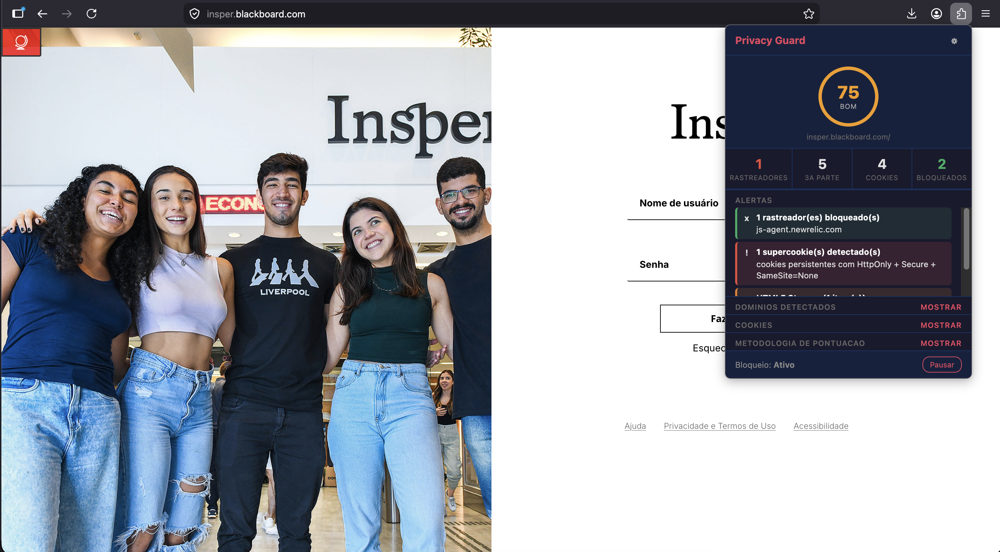
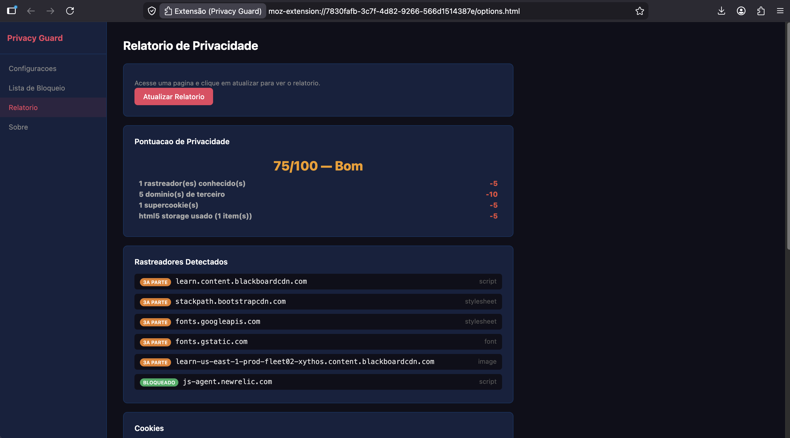

# Cybersecurity

Avaliacao Intermediaria — Cyberseguranca (Insper)

## Plugin: Privacy Guard

Extensao para Firefox que detecta rastreadores e violacoes de privacidade durante a navegacao.

**Desenvolvedoras**

Isabela Vieira Rodrigues
Deena El Orra


## 1. Estrutura

```
plugin/
  manifest.json       configuracao da extensao
  popup.html          interface do botao da extensao
  options.html        pagina de configuracoes
  css/
    popup.css         estilo do popup
    options.css       estilo da pagina de configuracoes
  js/
    trackers-list.js  lista de rastreadores conhecidos por categoria
    background.js     script de fundo: intercepta requisicoes e cookies
    content.js        script da pagina: detecta fingerprint e hijacking
    popup.js          logica do popup
    options.js        logica da pagina de configuracoes
  icons/
    icon-48.png       icone 48x48 px
    icon-96.png       icone 96x96 px
```

## 2. Como Instalar

1. Abrir o Firefox
2. Digitar `about:debugging` na barra de endereco
3. Clicar em "Este Firefox"
4. Clicar em "Carregar extensao temporaria..."
5. Selecionar o arquivo `plugin/manifest.json`

## 3. Funcionalidades

### 3.1 Deteccao de Dominios de Terceira Parte

- Intercepta todas as requisicoes feitas durante a navegacao
- Compara o dominio da requisicao com o dominio da pagina atual
- Exibe os dominios de terceiros encontrados com tipo e categoria

### 3.2 Bloqueio de Rastreadores

- Cancela automaticamente requisicoes para dominios rastreadores conhecidos
- Usa lista interna com mais de 80 dominios em 5 categorias: advertising, analytics, social, marketing e data
- Permite pausar o bloqueio pelo popup

### 3.3 Monitoramento de Cookies

- Detecta cookies via headers HTTP (`Set-Cookie`)
- Diferencia cookies de primeira e terceira parte
- Classifica como sessao (sem `expires`/`max-age`) ou persistente
- Identifica supercookies: persistentes com `HttpOnly + Secure + SameSite=None`

### 3.4 Armazenamento HTML5

- Intercepta chamadas a `localStorage` e `sessionStorage` (`setItem`)
- Le itens ja existentes no carregamento da pagina
- Detecta uso de `IndexedDB` e `Cache API` (supercookies avancados)

### 3.5 Canvas Fingerprinting

- Intercepta `toDataURL`, `toBlob` e `getImageData` do canvas
- Detecta quando a pagina le pixels do canvas para identificar o navegador
- Registra o evento e desconta pontos na pontuacao de privacidade

### 3.6 Sincronismo de Cookies

- Detecta cookies enviados via header para dominios de terceiros
- Identifica parametros de ID de rastreamento em URLs (`uid`, `uuid`, `cid`, etc.)
- Registra dominio e descricao do sincronismo detectado

### 3.7 Deteccao de Hijacking

- Monitora scripts injetados com padroes de BeEF (`hook.js`, `/beef`)
- Detecta scripts carregando de portas nao-padrao (3000, 4444, 8080...)
- Alerta sobre chamadas `eval()` com codigo extenso (possivel ofuscacao)
- Monitora WebSockets para dominios externos ou portas suspeitas
- Detecta iframes ocultos (possivel clickjacking)
- Monitora alteracoes em `document.domain`

### 3.8 Lista de Bloqueio Personalizada

- Adicionar e remover dominios manualmente
- Importar lista em formato TXT (um dominio por linha)
- Exportar lista atual como arquivo TXT
- Lista branca de dominios que nunca serao bloqueados

### 3.9 Pontuacao de Privacidade

- Pontuacao de 0 a 100 calculada automaticamente a cada pagina
- Metodologia com 10 criterios e deducoes ponderadas
- Classificacao em 5 niveis: Excelente, Bom, Regular, Ruim, Critico
- Detalhamento completo das deducoes no popup e no relatorio

### 3.10 Interface e Relatorio

- Popup com pontuacao, contadores e alertas em tempo real
- Pagina de configuracoes com 4 abas: Configuracoes, Lista de Bloqueio, Relatorio e Sobre
- Relatorio completo com rastreadores, cookies, hijacking, storage e cookie sync

## 4. Metodologia de Pontuacao

| Criterio                    | Deducao              |
|-----------------------------|----------------------|
| Rastreador conhecido        | -5 cada (max -35)    |
| Dominio de terceiro         | -2 cada (max -15)    |
| Cookie de terceiro          | -3 cada (max -15)    |
| Supercookie                 | -5 cada (max -10)    |
| Canvas Fingerprinting       | -15                  |
| HTML5 Storage usado         | -5                   |
| Armazenamento avancado      | -5                   |
| Sincronismo de cookie       | -10 por dom (max -20)|
| Hijacking alta severidade   | -20 cada (max -40)   |
| Hijacking media severidade  | -10 cada (max -20)   |

| Faixa  | Classificacao |
|--------|---------------|
| 80-100 | Excelente     |
| 60-79  | Bom           |
| 40-59  | Regular       |
| 20-39  | Ruim          |
| 0-19   | Critico       |

## 5. Categorias de Rastreadores

| Categoria   | Exemplos                                    |
|-------------|---------------------------------------------|
| advertising | DoubleClick, Criteo, AppNexus, Taboola      |
| analytics   | Google Analytics, Hotjar, Mixpanel, Segment |
| social      | Facebook Pixel, Twitter Ads, AddThis        |
| marketing   | HubSpot, Marketo, Intercom, Pardot          |
| data        | Demdex, BlueKai, LiveRamp, DoubleVerify     |


---

| Popup na navegacao | Pagina de configuracoes |
|---|---|
|  |  |


